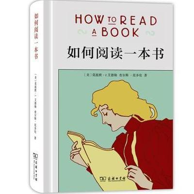

# 再读《如何阅读一本书》（艾德勒、范多伦）

&copy; 邓亚军（记） 2019-12-6

2018年6月，第一次阅读，这本书由美国作家莫提默.J.艾德勒和查尔斯.范多伦所著，郝明义、朱衣翻译。阅读时，总是感觉内容好像和上学时高中课文里的一篇英语文章好像类似。这本书讲了如何阅读一本书、一篇文章的系统方法，让你的阅读效率更高、收获更大，所以，最近得空，也是受《书都不会读，你还想成功》这本书的启发，就想着再读一遍此书，读后总结下书的内容和个人的感受。

首先介绍一下这本书大体情况，《如何阅读一本书》第一版于1940年出版，深受读者喜爱，并且翻译成多种语言在全球热销，随着时代的变化，经过三十多年积淀作者于1972年进行了第二版的更新，在第二版里作者更为强调阅读的艺术，并指出对这种艺术水平更高水准的要求，而我读的也是最新的1972版本，或许你也在其他老师的读书推荐目录里看到过这本书。本书就是告诉你“读书太快或太慢，都一无所获”，提出不同速度的阅读方法，以及不同题材书籍的阅读方法，告诉你，如何阅读一本书是有系统方法的，科学的方法，有效的方法，有收获的方法，其实也就是“有时候要读的慢一点，有时候要读的快一点”，那么这个“有时候”该怎么把握呢？这就是本书要告诉你的答案。

作者也在书中也指出，这本书是方法类的书，是不解决问题的书，注意，请别误解，所谓不解决问题是指你无法从书中直接找到一个问题的标准答案，除非你去做，实践出真知，你需要做的是掌握书中的方法，在本书之外去多读书、读好书、好读书，去践行、体会、找寻其中的乐趣。

好了，读了此书，我简单梳理下这本书的架构和内容。本书分四篇：

## 第一篇：阅读的层次

> 这一篇，作者分了五章来介绍阅读活力和艺术，阅读的层次以及介绍了其中的第一、二层次即基础阅读、检视阅读，以及如何做一个自我要求的作者，告诉读者在读一本书是首先应该准备什么，特别是心理准备，以及一些做笔记、阅读习惯方面的内容和方法。

## 第二篇：阅读的第三个层次：分析阅读

> 本篇主要介绍分析阅读，分析阅读是核心的阅读方法，也是读一本书最重要的方法，所以，集中大部分篇幅在介绍此方法，从一本书的分类、透视一本书、与作者找共同的词义、判断作者主旨、评判一本书、赞同与反对、辅助阅读等等，通过由浅到深的方式不断去窥视作者的表达及想法，从而尽可能的与作者共鸣般的去探寻一本书的观点和作者的内心。

## 第三篇：阅读不同读物的方法

> 本篇是实用化的指导，作者直接告诉你不同类型的书或者读物的阅读方法，主要有实用型的书、想象文字、故事、戏剧、诗、历史、科学、数学、哲学、社会科学等各类，不同的书、读物有不同的方法，采用不同层次的阅读方式你才会更高效、更有效的学习一本书。

## 第四篇：阅读的最终目标

> 本篇介绍了阅读的第四个层次以及阅读的目标，主题阅读是阅读的第四个层次，也告诉了主题阅读的步骤。同时，好书会给我们什么帮助？那就是阅读的最终目标——生命与心智的成长。

通过阅读本书，你会了解到阅读分四个层次，与我们日常的阅读方法可能非常不同，不是拿起一本书从头到尾顺着读，读完后面忘了前面，也不知道这本书到底在说啥，作者要表达啥怎么说，更不可能了解到这本书说的是否有道理，以及与我到底有啥关系，所以，最后读是读了，好像没啥收获，也不可能提高我们的心智，改变我们的习惯。

> 第一个层次：基础阅读
> 第二个层次：检视阅读
> 第三个层次：分析阅读
> 第四个层次：主体阅读

对了，书中作者还介绍了做读书笔记的方法，也是喜欢读书学习的朋友们必读的第一本书，告诉你科学的读书方法、阅读思路，让你喜欢阅读的优点在科学、高效的阅读方法指导下助力你的学习、生活，改善你你的思考，改变你的人生。

------

[豆瓣介绍](https://book.douban.com/subject/1013208/)

