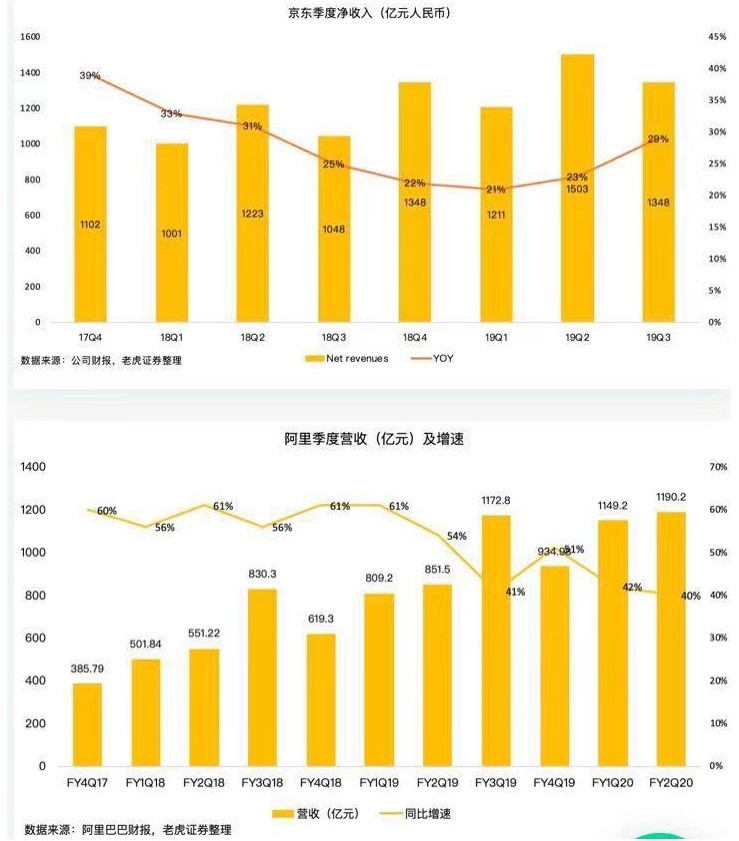
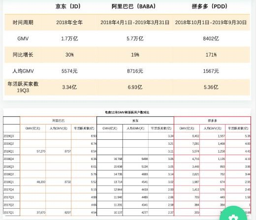
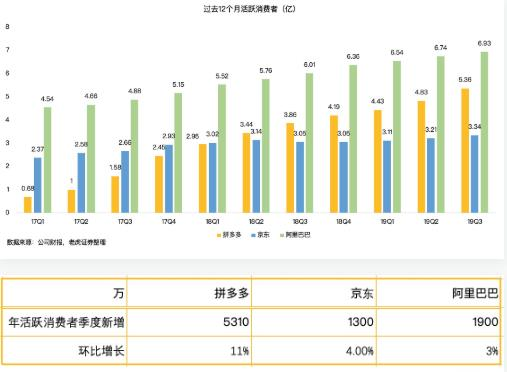
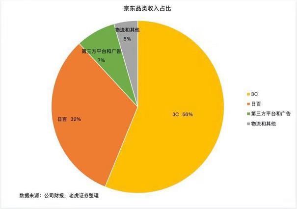
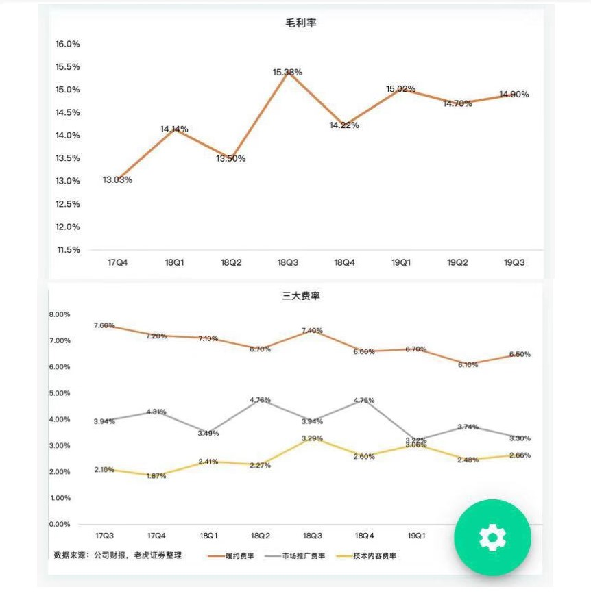
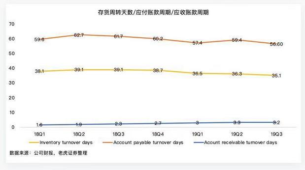
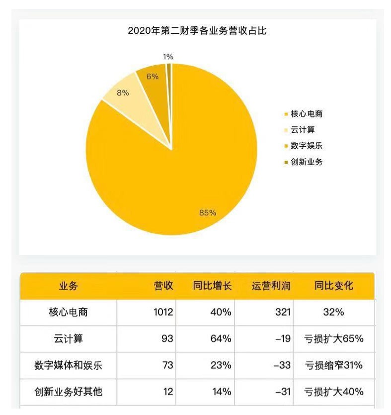
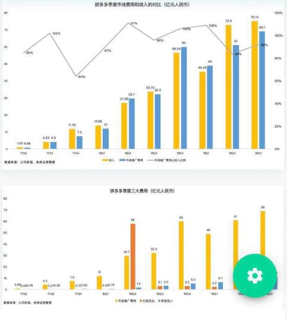

# 学习王珊老师《读懂财报》课 (4) 实际案例分析

王珊（授课）&copy; 邓亚军（整理） 2019-12-26

------

本节我们通过分析京东、阿里巴巴、拼多多的实际财报来分析看看能得到什么？按以下步骤进行解析：

1. 净利润
2. 核心运营数据
3. 利润来源

## 一、净利润

通过以上报表可以粗浅的对京东、阿里、拼多多三家公司的营收、增速、净利润指标进行了解，以及是否超预期，同时还可以对比着来看出：拼多多的体量远远不及京东和阿里，但是，因为京东和阿里的财报口径不同，实际上三家单位在同一级别。最终可以看出：

> 阿里的收入规模同比增长大于京东，这么大体量依然保持40%以上增长非常难得；
>
> 京东的增速比一季度21%要好，已在提速，所以也是超预期的；

总结下，在看了财报收入、利润的指标后，并且知道了净利润与调整后净利润的区别和来源，我们就会更客观地去看公司的业绩，所以下来再看核心运营数据。

## 二、核心运营数据

电商类企业，运营数据主要看两个核心指标：营业额GMV、年活跃买家数，当然人均GMV、月活跃买家数都是基于核心指标扩展的。

通过以上财报数据看出，拼多多的GMV与阿里、京东还是差距挺大，但是其增长速度非常快，达到171%，同时其年活跃消费者季度新增达到5310万，环比增长11%，比京东和阿里巴巴新增更快。所以，可以预见拼多多未来的用户数很快会达到阿里的水平。阿里巴巴已经趋于稳定，而京东增长更缓。

## 三、利润来源

### 京东

京东的收入来源于卖货、服务，而卖货即商品收入占主要收入。京东主要有56%的收入由3C贡献，但是3C的毛利很低，这也是这些年京东一直不盈利的主要原因，所以，如果京东的其他业务如日百、广告、服务、物流等业务占比有所提升、 而3C业务占比降低的话对公司毛利的贡献就会有很大提升，这对于一个万亿级营收的公司来说，毛利增加一个点其利润总额也是非常可观的。

京东是以卖货商品销售为主，其成本费用对于利润直接影响，这主要有三大费率：履约费率、市场推广费率、技术内容费率，如上图指标可以看出其利润与费用的关系及情况。

> 现金周转天数 = 存货周转天数 + 应收账款周转天数 - 应付账款周转天数

- 存货周转天数：货买的越快越好
- 应收账款周转天数：钱收的越早越好
- 应付账款周转天数：应付款付的越晚越好

> 现金周转天数指标只在分析京东财报时用了，原因是阿里、拼多多的收入来源主要是平台服务费用，而不是卖货的费用。

### 阿里巴巴

阿里的主要业务在于核心电商业务，占到总营收的85%，也可以看出在阿里的四大业务板块中有且仅有核心电商业务是盈利的。但是，阿里可以通过核心电商业务为集团带来源源不断的现金流，从而可投入到云计算、数字媒体等新业务板块，只要阿里的核心电商业务保持稳定，阿里就是稳定的，而85%核心电商业务中有64%来源于中国区的零售业务，只要中国区的零售业务表现稳定，阿里业绩表现就稳定。但是，若支撑核心业务的平台佣金没有增长的话就比较悲观了。

云计算业务虽然增速很大，但是同比一直在下滑，与亚马逊和微软40%的增长速度相比来看的话64%增长还是不错的，其中管理层在电话会议中提到95%上市公司选择了阿里的云计算业务，那可以看出阿里云业务在国内还是有很大市场的，这是一个亮点。

烧钱的业务如文娱创新业务方面，阿里近期也一直在减少投入，在经济不景气背景下，阿里没有烧很多钱；但是投入一些小资金在创新业务利润也是相当可观、可期的。

### 拼多多

拼多多的收入方式只有一种，就是平台运营费。因为拼多多还在亏损，所有我们主要看看公司的费用情况。

市场推广费用在公司费用支出中占比最大。所以，要看看费用收入比如何？可以看出，2019年一季度之前费用收入比基本在100%以上，收入但是二季度开始费用收入比降到84%，但是三季度费用收入比有扩大到92%，这是因为在三季度拼多多在搞一个百亿补贴活动，将费用投入到市场换用户，用户就是资产，这是另一个角度看投资和资产的定义。

那么，有什么结论呢？通过GMV可以看出阿里营收是最大的，增速最快的是拼多多，对于投资来讲：

> **阿里：稳定型投资者可以买阿里，因为阿里的GMV、用户人数都是最大的，增长也好于京东，阿里因市场都盯着而没有争议，她的股价和业绩一样——大而稳定，所以，不要期望他带给你超额回报。**

> **拼多多：是一个成长型、有争议的企业，他的增速很快，用户数也很庞大，而只有有争议的公司才有机会获得超额回报，所以，对于倾向成长型的投资人，可以选择观察拼多多。**

> **京东：增速没有阿里好，也不如阿里大而稳，但是他会被机构当成配置型的选择对象。阿里必须配置，京东会少量配置，一个老大，一个老二。**

今天我们学习完了如何读财报的最后一课，通过四节课，我们初步了解了财报、三张表、如何看财报以及如何实例分析财报的步骤和方法。但是，如何更好、更快、更准确的通过财报数据去评估一个公司，从而对我们的投资决策带来指导，这还需要我们使用课程的方法，多读、多用、多想、多实践，这样才能达到熟能生巧、炉火纯青的地步。

欢迎继续关注！

------

> 1. 本文内容及图表来源于老虎证券的王珊老师在mixin上的BOX定投践行群授课内容整理而成，未经授课老师校核，文章内容可能与作者想法有偏差，请参考学习；
> 2. 本文只作为对财务或投资爱好者的学习和交流，不作为、也不允许作为任何商业用途使用；
> 3. 想了解和深入学习投资知识，请加微信：denzii，咨询了解，带你进践行群接触投资大佬，并对英语、编程、沟通、写作、财务、销售等知识进行系统学习，提升你的操作系统。
> 4. 喜欢读书的朋友可以关注或加入我的小组【读书与学习】（创作、激励、协作，区块链主导的创作者社区），分享你的读书感想，讨论新的读书计划，组队一起践行读书与学习，点击下面链接或者扫二维码进入：

[W3C社区小组：读书与学习](https://w3c.group/g/1124622/join?ref=2307e1c2)

