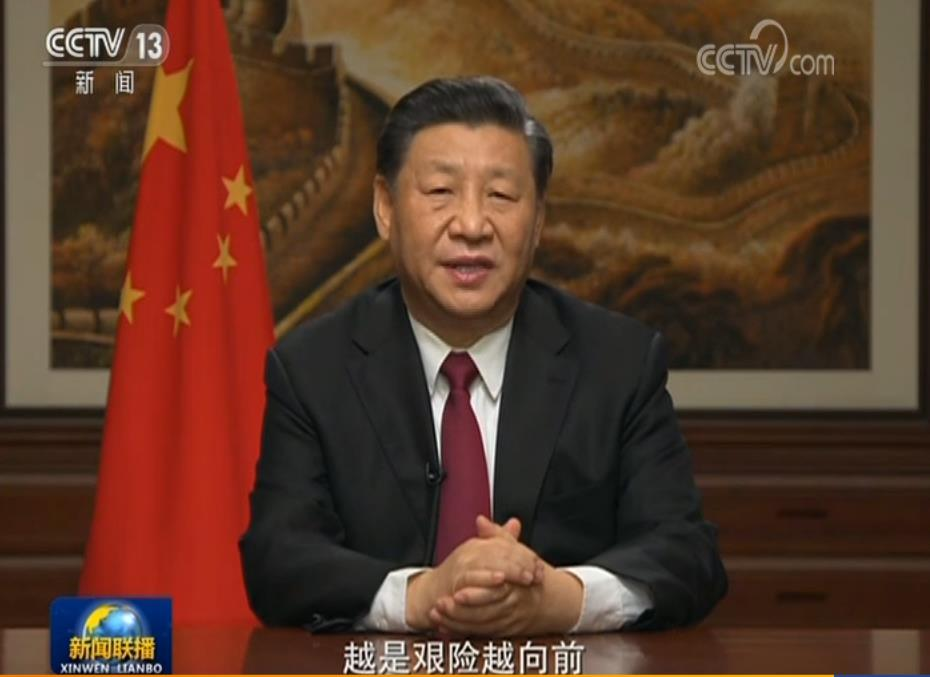

# 我这一年

> <u>**2019年终总结和2020年度规划**</u>

 邓亚军（记） 2019-12-31

2019年再有几天就结束了，忽觉时间匆匆，一年又一年，简单思量，未有满足，即刻到站；因此，做个回顾，立个flag，对2019年做个总结、盘点，为2020年做个目标规划。

## 2019年

过去的一年，围绕事业、生活、学习展开，除去睡觉吃饭，时间精力耗费于此。简单概括“**工作努力但不出彩，生活紧张而富精彩，学习紧张效果初显，理财践行未来可期，其他点滴继续努力**”。自觉重要，逐条流水。

### 一 事业

何谓事业？何谓工作？事业是干自己的，工作是干老板的。工作可以作为事业的一部分，但工作一定不是事业的全部。除非你在给自己干，那么工作等于事业，否则早点觉醒或许会让你以更不同的心态去面对当下、利用好当下、投资好当下。所以，本来想用工作作为开题，但是经过学习觉得用事业二字更为合适。

1. 事业的意识。2019年认知到事业这个意识，知道努力工作没错，但要有干自己事业的远大理想，一切都为事业增砖添瓦。而2018年依然仅仅在为工作没日没夜，致使自己没有进取空间与目标。
2. 组织的行动。2019年反思过去工作的不足，探索自我资源与关系，搭事业组织，虽未有成绩，但或许开始行动就是初始最好的答卷。而2018年依然在患得患失、矛盾不安中与工作较劲，没有事业心的想法。
3. 关系的拓展。2019年基于事业的初衷维系拓展自我资源与关系，豁然开朗，不急不躁，尝试介绍建立自我圈子，未有业绩，始得自然。而2018年依然疲于项目、疲于工作，没有借力借势为己之业。
4. 新业务推进。2019年虽协助新业务，但自我内心是借于此的个人证明，奋力操持，从无到有，合力而为，趟出新道，走上正轨，虽有两错，运气差矣，势之必然，略有抱憾，然己无悔，悟得利益，悟得所得；而2018年上半场依然勤勉，下半场空余气力。
5. 去最艰难地。2019年在怀疑中收拾烂账，或是贬罚，亦或逼退，亦或安排，盯于琐事，运气使然，初得侥幸，习得缓急，懂得收放，看得淡然。而2018年依然迷茫现状、逃避职场，无稻草之的、无一一之标。
6. 略有小欣慰。2019年边缘中心，无问庙堂，但尽心尽力，助力同袍，喜获小单，不待赞扬，心有所慰，出于事业，不为当下。而2018年依然无缓气之隙，无平然之心。

事业工作，不矛不盾，2019年有事业之心，有了工作之实，虽费心费力然果不出彩，但尽心上力而心无所悔。退工作半步而观事业之貌，做事业之梦而促工作之进，乐哉喜哉，感恩戴德。

### 二 生活

何谓生活？生下来，活下去！这是生存，生而存在。工作需要理性，生活需要感性；工作需要条理，生活需要饱满；2019值得回味，是最坏的一年，也是最好的一年。

1. 迎来新生命。在担忧、平淡、期待、新生中，三口之家迎来一壮丁，建立完美阴阳平衡，从此不再受”欺负“，不再屡屡投票中处于下风；新生命赠送你”生“的惊喜与期待，新生命反省你”活“的意义与充实，新生命打开新”生活“新的篇章，静待四人尽情挥洒。而2018年，你依然延续已有的、那时的开心和烦恼。
2. 对家多付出。立马本命年，结婚八载余，有家有归宿，有梦有奔头。对家要付出，有爱要表达；适应家的变化，找到新的节奏；接送上课，辅导陪练，洗衣做饭，柴米油盐，喜怒哀乐，吃喝玩乐；依然不足：爱的表达、情的释放、欲的放纵、心的沟通；打听骂俏骚，淘气捣蛋扰，仪式感要有，生活滋味好；付出才有记忆，经历才留足迹。而2018年在刹车中积聚时间而无心顾家，继续平白直叙的日子。
3. 陪伴重参与。成长很慢，看不见高；成长很快，不带你玩。陪伴不是接送，陪伴不是旁站，成长更需一起哭笑，成长更需参与玩耍；见证她的长大，惊喜她的琴字 ；惭愧不如她努力之得，惋惜不如她惜时如金。参与体验式成长，是对双方的鼓励；教授说教式吼叫，是对情感的争吵；陪伴左右，参与其中，一起向上，留下精彩。而2018年离多聚少、心烦意乱、避免纷扰、付出极少。
4. 体育贵坚持。篮球变成每周的期待，跑步释放夏天的燥热，消瘦成了见面的问候，精神带来陪伴的快乐。折磨自己身体，坚守内心坚持，改变形象在外，历练品质在内。而2018年则断断续续，有心无力。

生活之精彩，在于发现不在平淡，在于不同不在雷同。这是最坏的一年，因为没有比这更年轻；这是最好的 一年，因为没有比这更丰满。

### 三 学习

何谓学习？学即抄，习即练。学在校外更需学，习在日常更需习。好好学习，天天向上。越学越知贫，越习越知难。越学习越谦虚，越学习越谨慎，越学习越低头，越学习越缄默。2019年是学习的一年，虽不系统，但无遗憾，偶有懈怠，但得组织，暂无好果，但有所望。

1. 读书。读书很多本，不知有多少；不做细思量，唯有肚知明。读到方法看了技巧，阅得小说习了说教。喜爱理财投资，涉猎新闻时事，偏爱股票房产，初涉区块链闻。
2. 上课。付费学2019财商课程，听大师经验之谈，涨为所未闻之新。付费进BOX定投践行群，听笑来老师之道，明投资创富之理，践定投时间之事，与志同道合者行，弃不知不明之音，享金钱时间之利。听喜马拉雅，大宇陪伴，树泽指道，雪球新闻，老王补充......
3. 写作。学Github、Typora、W3C、微博、头条等，建自己之网站域名（[区块链小白书](http://adipower.cn/#/)），写读书与学习之心得小组（[W3C：读书与学习](https://w3c.group/g/1124622)），建自己之Github之开源仓库（[Github：denzii818](https://github.com/denzii818/)），更心得动态之微博（[新浪微博：重复就是力量](https://weibo.com/p/1005051654718915/home?from=page_100505&mod=TAB&is_all=1#place)），发文事小，方法事大，完成总比完美好。计划写书未提笔，习得方法明年来。
4. 英语。跟liuda读第一本英文书《BEYOND FEELING》，差距很大，好在坚持；认知思维，批判思维，改善思维，未完继续。
5. 编程。学习Python，需要学习，应该学好，习得方法，投入时间，建立应用。
6. 考试。考了一建，投入不足，一门未过，明年两门。
7. 专利。取得发明专利授权一项。

凡有心得感悟，微博点滴记录；喜怒哀乐寄存，抱怨流水有痕。若有兴趣，点击给赞（[新浪微博：重复就是力量](https://weibo.com/p/1005051654718915/home?from=page_100505&mod=TAB&is_all=1#place)）。学习之路漫，时代之变快，唯有学和习，方立新时代。

### 四 理财

何谓理财？你不理财，财不理你。理财，是富人所为，让金钱为你工作，为你一天24小时不间断打工。穷人为钱工作，富人让钱为他工作；富人不断投资买入资产，穷人不断消费买入负债。习得理财，留一念想，方得惊喜。2019年，学习理财，践行一年，初尝收获，亦有亏损，不急不躁。

1. 基金。每月定投，坚持一年，收益均正，喜有15-25%，时间有价，更在坚持。
2. 股票。一言难尽，没有喜悦，买卖随意，没有章法，唯一之收获，关注和习惯。
3. BTC。跟随大宇，从无到有，关注新兴，规划践行，坚持策略，虽有亏损，不燥不割，一切可待。
4. BOX。跟随笑来，从无到有，习得原理，立标定策，简单定投，七年之痒，社群同行，只为未来。
5. 储蓄。虽为失败者之行为，但确无剩余之储蓄。分析原因，制定计划，来年优先，坚决先己。

投资是时间的玫瑰，市场是周期的规律；市场是风险收益的平衡，投资需有跨越牛熊的心理，唯有时间才是伴你成长的资本。理财投资，需要金钱，也需时间，更需耐心。

> [分享：桥水基金创始人达利欧演讲-《成功的原則》](https://www.bilibili.com/video/av46963162?p=1)

### 五 其他

1. 感恩给你机会的人。给你做事、学习、犯错机会的人，是希望你学习成长的贵人；以干自我事业的出发点去好好把握，好好珍惜；没有给予，不可有果，虽有努力，机会难得。
2. 人不为己，天诛地灭。人之初，性本私。不为己的人，视之无目标。不为己的人，没有源动力。不为己的人，难体会得之不易，难珍惜拥有之贵。为己争取在于主动、在于内心；别人给予在于别人之虑、在于被动。
3. 不急不躁，顺其自然。人心隔肚皮，难晓内心事。人是个体，人有思想。对事尽心而不强求，待人尊重而不小觑；如意之时勿狂，平常之时勿急，不顺之时勿燥；万物有理，顺其自然。
4. 在忙也要给自己留时间——思考的时间。忙忙忙，忙盲茫。低头拉车不看路，只能围着磨盘转。思考不足、思考顺境，刻意提醒，强制改变。只有变，才应变。

2019，我的一年，匆匆而过，寥寥数语，算是总结，失难复得，唯重当下。

## 2020年

2020年是自己的本命年，36岁，一个奋斗而不年轻的年龄，需要更多调整和尝试，坚持做自己的事业，干好本职工作，为家庭及生活参与、承担，学习学习的方法，坚持践行。

### 一 事业

1. 梳理业务及产品形成清单，开始展开，做成事情。
2. 梳理拓展自主关系资源：重点省份如闽川渝晋豫辽。
3. 关注电力市场：市场方向、技术产品、应用需求，每月完成一篇动态观察。
4. 认真工作，完成本职工作任务目标。
5. 以事业的态度去思考、做事待人。

### 二 生活

1. 对家付出。真心和行动付出在家庭，尽应付的责任。做一个调皮捣蛋的大坏蛋。
2. 陪伴参与。陪伴并参与大宝、二宝的成长与学习，做教练式的慈父和丈夫，共同成长。
3. 锻炼身体。坚持每周锻炼，完成至少一次。春暖花开跑起来。

### 三 学习

1. 读书。完成清单目录的书50本，写50篇读书笔记发布在W3C和微博。

2. 上课。听笑来系列课，关于投资、学习、表达、财报、沟通、销售，微博随时记录每个感悟。

3. 写作。完成以下：

   > 完成《富爸爸穷爸爸》一书每章节内容分享和个人解读，完成读书笔记和喜马拉雅音频录制；
   >
   > 完成《你这人：前十年》书籍第一版编写；
   >
   > 完成《如何运用一个企业》书籍第一版编写；

4. 编程。学习python编程解决投标价格分析软件和合同登记管理软件。

5. 考试。通过一建考试，考试合格。

6. 专利。撰写发明专利一篇。

### 四 投资

1. 坚持执行既定理财计划：先投资再消费。
2. 定投股票：改变策略，定投潜力股票。
3. BTC：跟随大宇，继续学习BTC投资。
4. BOX：跟随笑来，继续坚持BOX定投。
5. 探寻其他的场外挣钱方式和投资门路。

### 五 其他

暂无。

