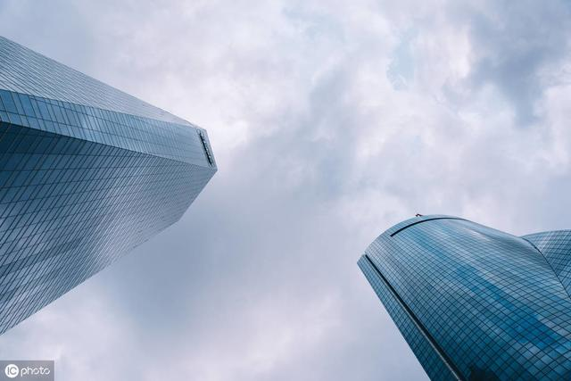
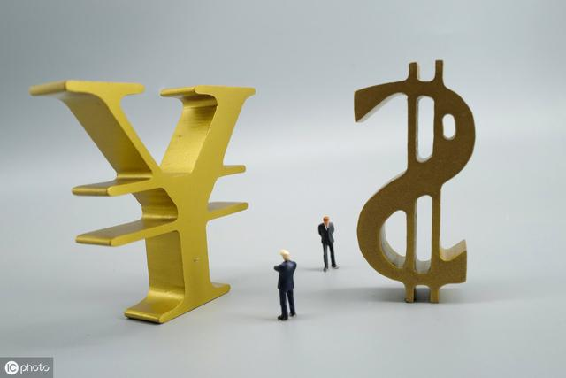
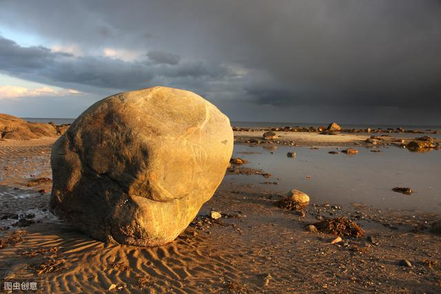

# 一个平民老百姓对财富的感同身受

 邓亚军（记） 2019-12-28

------

当下最热的话题无非股市和华为。

股市是2019年第一季度涨幅迅猛吸引了一波波韭菜和资金疯狂进入，抢抄为数不多的底，人人希望暴富，这从火车、地铁上抬头低头间总能看到周边手机都飘着红绿曲线可见一斑；而华为，虽离老百姓个人暴富无现实当下的直接关系，但因为贸易战使得华为已然成为人人谈论当下国际形势的不变话题，每日一更，甚是热闹。

今天，个人作为这个社会的一份子、国家集体中的一个人，谈谈个人对祖国发展变化的感受，纯粹胡扯，欢迎喷粪。

我，80后，来自农村，读书、上学、工作，离开老家，来到山东，感受了从小上学两脚泥，吃芽麦（一种夏收小麦因阴雨天无法及时收回而发芽的麦子），挖红薯，放牛，收玉米....种种小时候丰富多彩的生活，到离开农村到城市楼栋生活，经历和感受了这个社会翻天覆地之变化，国家安定，生活更好，人人追求更多自认为向上的东西和目标，也享受和分享了这个发展过程的成果。

有一天，老爸对我讲：“现在钱不值钱了，放到银行还是那个数，可能买啥呢？“，是啊，老爸有一身手艺，老家乡镇上人都知道他盖房子最快最好，价格还公道，都喜欢找他干，房子是农民一生最重要的资产，可能当时的人还没有这个概念，只是最好的窝要让最棒的人干，这样住着才踏实。老爸一辈子就跟砖头水泥打交道，到今天还离不了，一天不干活就闲的难受。所以，小时候我觉得我们家还算富有，至少在村子里算的上，88年是村里头几家买黑白电视的，一到晚上村里人都来俺家看电视，我和弟弟从小没有因为吃喝犯愁，后来装电话，种庄稼买拖拉机、摩托车、彩色电视、盖大房子.....我们家在老爸的规划下总是走在村里前面。也让我亲身感受到：一门手艺有多重要！

可是现在，老爸为什么这么说呢：钱不值钱？10年前的10万元和现在10万元差的太大了！

钱不值钱了？

我觉得有两个原因：一是和平时代财富的表现形式发生变化；二是个体对于财富的掌控因时而变。今天简单说下第一点。随着中国经济的发展及需要，货币不断增量、贬值，货物品种增多，需求量能增多，金钱购买力下降，在不同阶段和年代，单纯的货币数字实则代表的货物价值不同，甚至差别十万八千里，同时，老百姓的工资待遇也提高不少，甚至翻翻好多。所以，对于父辈来讲，单纯数字金钱在前后时代的现实中已无法对比，特别是对习惯于储蓄的老百姓，唯一感受到的是存在银行的钱越来越不值钱。实在是货币数字在银行的增值与经济发展带动的整个社会资产的增值完全无法匹配，对于没有投资意识的老百姓，只能眼睁睁看着个人金钱及发展红利流入到富人口袋。

中国从改革开放至今，主要基调没有变化，那就是经济发展。解放后国家不断探索，从国家计划经济，到集体公社、包产到户，再到让一部分人先富起来，无非都在调度和激活这个社会个体的主动性和积极性，包括后来工人下岗、商品房等在那个时代被认为是种不舒服的做法。人主动了，就想办法了，没人管了，就要自己管，这才吃饱了饭，吃饱了就想着吃好的，吃好了就想住好的、玩好的，也更想着受人尊重，这才有了不断发展的动力，一个人、一个人家庭的财富从最初的吃饱喝足到追求住好有钱有身份、越高阶越富有的表现形式。而这背后，就是因为国家稳定这个基石。没有稳定，谈不上吃饱吃好被人尊重。即使，在那个过去的三十多年里，我们被人打、被人欺负，国家领导人卧薪尝胆，不被老百姓所理解。无欲则刚，当对一个国家来讲不是义气、冲动就能刚起来，而需要自身刚，自身强大，自身硬气，而这就需要经济发展，只有经济发展我们才能有机会、有时间、有财力去打造自身，去提高自身，去可能给这个国里的人民好的生活、学习、成长的机会，给这个国里的企业赢得发展的空间和时间，才可能成长出今天如华为一样众多的企业和民族支柱，今天的中国是几代人共同坚持、坚守、努力而来的，来之不易。

潮水退去，谁在裸泳？

如今，潮水要退去，而谁在裸泳？都急了，在骂川普这个骗子，你让全球人民怎么过活，你为啥不按照大家习惯的老路继续走，到底在瞎搞啥？是啊，走老路多容易，但那是不是是走向衰败的老路、一直下坡的老路呢？！企业家出生的川普，是一位选择了吃洋葱也要像吃苹果一样坚持下去的实干家，他不会选择走老路，那怕是最后还是要再回到老路上来但他首先要尝试走走新路，让人不舒服，不择手段，永不放弃，这才是要整合整个国家资源像打造一个企业一样去打造一个新的额麦瑞肯，为了这个“企业”的所有股东——米国人民。

潮水退去，我们才发现，原来能够作为基石支柱的只有华为、大疆、海康...，在额麦瑞肯人眼里的也只是这些真正有自主实力、能威胁和挑战权威的企业，而那些被国人整天比来比去吹嘘在天的BAT人家根本不在乎，或者说还是没顾上。

潮水退去，我们才发现，原来这个国家那些默默无闻一心一意做企业、做备胎计划、做10%研发投入的傻瓜才是真正打造自己、提高自己的、卧薪尝胆的真正勇士，看得远、想的清、做的坚持，这才是几代人用市场、屈辱换来的唯一敬重，也是国家领导人坚持改革开发、经济发展最想要的目标。

潮水退去，我们才发现，这对我们是好事，这些年我们太顺，我们到哪里都可以唱国歌，但是，当威胁来临时不是唱歌就能解决的，而是你有没有化解危险的筹码与实力；对我们是好事，让额麦瑞肯帮我们挑选了真正的具备投资的企业，让我们真正知道哪些是实干的企业，哪些是真正能扛起中国名片的企业，哪些是真正能够去冲锋国家战略高地的企业。

潮水退去，我们才发现，平民老百姓的一米一饭或许与额麦瑞肯老大是谁无关，但是，当那只蝴蝶拍打翅膀掀起波澜卷向这个东方巢窝时，窝下，岂有完卵！
