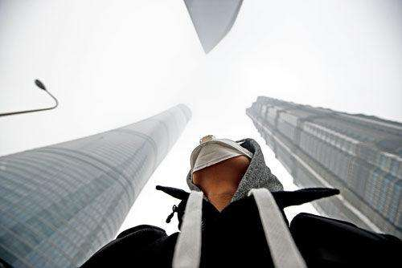

# 14-你还能在当下的突发中坚持多久？

 *<u>亚军（记） 2020-02-08</u>*



近期全国人民都在闭门修炼中，其乐融融：修炼做饭、修炼读书、修炼陪娃、修炼休息、修炼自我提高......可以说，2020年的春节或许是这些年以来最最最长的春节假期了，没有之一。大家忽然就有了时间，从来都渴望的长假休息日，就这么因为这么一个吃野味的家伙给轻而易举的被“申请”到了，并使得举国人民与其一起“享受”，也愣是把这个鼠年春节整的如此“静悄悄”、“心战战”。

但是，我想问大家一个问题：你觉得这场疫情什么时候会过去？

估计大多数人可能没怎么想过，又或者认为就听上面的通知呗，可能还有其他答案。但是，当我给媳妇说，估计至少还得两个月时间才知道情况是否明朗时，媳妇惊讶道：你可别吓我！

是的，可能我们的潜意识认为这肺炎很快能够被控制并治愈，疾病哪有这么长时间的，况且是传染性疾病，国家不可能不管，03年非典那么严重不也过来了吗；是的，可能我们也觉得过了正月十五这不都开始正常上班了吗，那能那么严重，绝对不可能，否则还不得继续隔离放假；是的，可能我们确实都已在自我隔离，封闭在家快三周了，也没出啥问题呀，况且近期也有人不断治愈出院，没传的那么凶险；等等，是的，我们都希望这场考验尽快过去，让我们回归正常生活。

但这疫情到底会持续多久，我不想去猜，也没资格去猜。但是，对当下这个突发疫情，我想说三点看法，给大家一些启示，希望有用，不喜勿喷。

> **凡事要有B方案**

凡事要有B方案，这不是在看美国电影，这是说我们对任何事情都要有备手，要有备选的方案和应对预案。如我的领导时常提到“凡事要做最坏的打算，朝最好的方向去干”、“凡事不要只想有多好，而要先想怎么跑”，这是一个意思。

当下的疫情可能会再持续一周、两周、一个月、两个月、三个月，但也可能持续半年，甚至一年。在这个最坏情况下，你会如何考虑并应对当下，以及如何回答题目的问题：“你还能在当下的突发中坚持多久？”，基于这个时间框架和逻辑，你如何做准备？你要做哪些准备？你的目标和计划又是什么？当最差、最坏的情况发生时你会如何应对？

出于如上思考，我相信你不会再单纯地抱有潜意识所认为的“两周后就没事、一切就恢复正常”的侥幸，而可能会考虑如下实际：

```
1-我准备的食物、药品、口罩以及日常用品够一两个月足不出户吗？
2-我孩子的教育学习怎么应对，如何使孩子的学习不被耽搁？
3-我家里的老人健康、养老怎么应对？如何保障自身健康？
4-我的工作还能做什么？工资能正常发放到手吗？我还有其他收入来源吗？
5-我的房贷还能正常还贷吗？日常支出怎么合理计划？
6-我的现金储备能支撑三个月、半年，乃至一年的家庭支出吗？包括在失去工资收入的情况下？
7-若以上问题不能得到肯定回答时，我还有什么办法来应对？
......
```

以上只是简单举的几个例子，只是想告诉自己，也启发大家，基于最坏的出发点，你的应对方案该如何考虑，也请你回答：**在当下的突发中，你还能坚持多久？而你的B方案又是什么呢？**

> **个人投资意识**

在当下的突发中，你看到了什么？除了闭门不出的人心惶惶，在生死面前一切都是那么渺小之外......还有什么？

我发现：对于个人、家庭、企业，现金流才是最最重要的。没钱你买不到20块钱的口罩，没钱你买不到家门口12元一斤的黄瓜，没钱你一旦不幸染病时可能连自己的小命都救不了....

而在当下的突发中，你能不能先活命，如果行，那么你还能坚持你的原来的投资吗？因为疫情总会过去，我们还要回归正常。

我发现：在突发面前，你的现金储备能不能、足不足应对突发，否则你的所有计划就会因当下的突发而打乱，从而致使你的投资计划前功尽弃。所以，如李笑来老师所讲，你应该用你如蛋壳般厚度的资金去投资，而你如蛋黄、蛋清般厚度的金钱就是为了保障你稳定、安全的生活。否则，若没有足够的现金流及稳定的储蓄保障，你不可能保证并践行你持续的投资计划；反之，如果你拿为了保障生活的资金来投资，一旦在你投资失败或损失时，你可能就万劫不复、留宿街头。而这会死人的，真正的死人。

所以，投资：**拿闲钱投资，不借钱投资**。或者要时刻问自己：**在突发出现时，我是否有足够的资金去应对突发而不轻易动用本来投资的金钱吗？更或者这样问自己：投资一旦失败，这会不会影响我的正常生活**。

> **企业危机意识**

当下，在生死面前，大部分企事业单位都基本是在家办公，所以，近期远程办公概念股横空出世，接连涨停；也有在线教育、线上购物更是被看好未来。但是，对于传统的生产制造企业，该如何应对？这类企业一般人员多、资产重、回款慢、有贷款、上下供应链长，在当下的突发中，项目停工、物流停运、生产停滞、施工停歇......资金回笼放慢，在没有资金来源的当下，企业如何保证资金链应对日常开销已成为摆在老板面前生死存亡的直接考验。

而这些开销可能包括：房租物业费、员工工资、银行利息、供应商货款以及企业运转所需的其他日常费用。这些支出在正常运转时要么通过企业经营流转的利润来支出，要么通过企业自有现金来支出。而在中国上市企业平均不到20%比例的现金资产下，一个企业若连续两三个月没有回款收入及现金流入，后果可想而知，而这更可能推翻多米若骨牌，影响上下游产业链，影响这个行业经济，甚至影响国家经济。

所以，**在突发面前，现金为王，亘古不变。在危机面前不挂掉，才是核心竞争力**。

这下让人更明白：衡量一个企业能不能存活，不是看他的利润、利润率，而是现金流，没有现金流，企业直接休克，停止运转。这就是当下突发中的企业危机之一，他给所有企业管理者上了现实中一趟活生生的企业危机课。

也让深深体会：做老板确实不易！

考题已经发放，还未到时交卷，就看企业怎么来答题，怎么让自己、让企业、更让员工活下来。


------

> 1. 想了解和深入学习投资知识，请加微信：denzii，咨询了解区块链mixin平台，带你进践行群接触投资大佬，系统学习英语、编程、沟通、写作、财务、销售等知识，提升个人操作系统。
> 2. 喜欢读书的朋友可以关注或加入我的小组【读书与学习】（创作、激励、协作，区块链主导的创作者社区），分享你的读书感想，讨论新的读书计划，组队一起践行读书与学习，点击链接或者二维码免费加入。[W3C社区小组：读书与学习 ](https://w3c.group/g/1124622/join?ref=2307e1c2)

