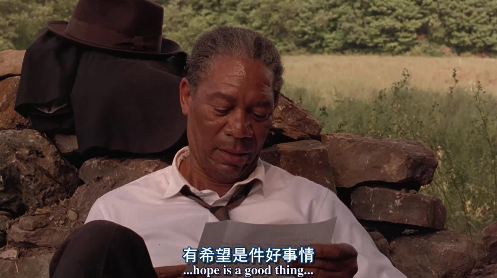
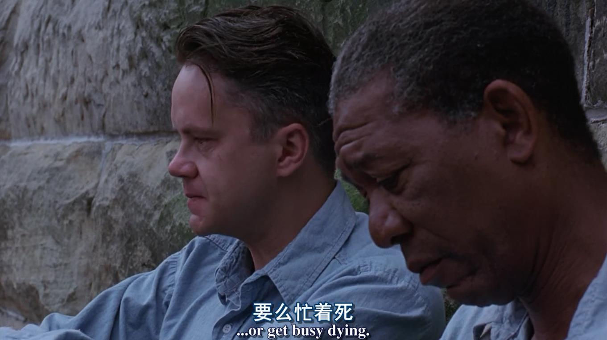
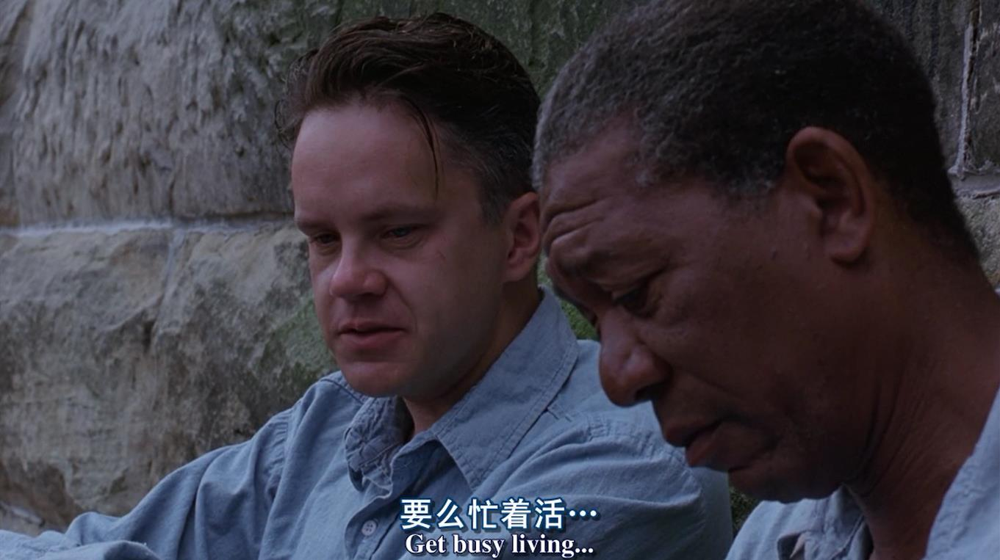

# 《肖申克的救赎》的观后感

&copy; 邓亚军（记） 2019-12-12

一直传说此部影片是如何好看，甚是好奇，记忆中第一次观看时好奇在于他是如何越狱的？以致对于影片实际映射的其他方面倒是印象不深，但是还是下载了这部电影的高清版存留在电脑，以便回头细细品味。

这不，最近李笑来老师讲，人在低谷时可以看看这部影片，一部关于希望的影片。所以，出差途中又拿出来仔细欣赏一遍，带着已知：瑞恩成功越狱；带着疑问：是什么样的希望？更带着发现：窥探电影背后对人生活法的启发以及对自我内心的鼓励，观后，感受颇深，亮点诸多，细节逻辑，希望满满。

观影三天后，回过头来继续完成记忆深处的感触！

------

**绝望**

当一个人一觉醒来忽然变成杀人犯，还是杀死媳妇的犯人，从银行家到落狱囚，从天堂掉到地狱，你会怎样？是的，和所有周边的人一样，内心坚持着无罪与清白，而不得已活在笼中却被改造，让你顺服和安心。

当唯一一次可以证明自己无罪而名正言顺被释放的机会到来时，却生生被黑暗抹掉挣扎无力时，你会怎样？是的，和所有周边人一样，内心绝望、愤恨世道，但你无能为力的抗争依然逃离不出现实绝望的围墙。

当唯一一个走出并可以窥探围墙之外一丝自由亮光的老者，身体逃离高墙，但精神却依然被束缚在那个冷冰冰的栅栏之中，最终被掉悬在旅馆阳台横梁时，依然有丝丝围墙绝望的拽拉。

在这里，没有啤酒、没有音乐、没有消遣、没有亮光，更没有希望、脱离现实的希望！当那种，有一天你走出这里你会去哪里的问题被抛出时，很显然，从那一个个眼神里你会看到惊讶、茫然、怀疑、罢了的内心，是的，在这里没有可能，没有可能有那种希望，那种奢望。

这就是绝望之地，无论在笼中还是现实中，我们是否还有梦想，那怕是一个旅馆、一艘船的希望，可能我们都忙着在其中被活着、被安排着、被奴役着，精神早已不再属于自己的躯体，没想过、甚至没有希望，顺应着当下现实，服从着环境一切，从未想过改变这里，改变自己，只有行尸走肉，挺着空空的躯体如僵尸般喘着。

------

**希望**

瑞恩，也这样吗？

你知道的，那没有，否则也不会有这部影片！

瑞恩成功逃离，逃离了现实，逃离的了体制，逃离了束缚，逃离了绝望和不可能，更逃离了自己。

一个心有梦想、有希望的人，生活在哪里都是自由，都是快乐。因为解决了狱的报税问题，看到同事喝啤酒而开心；因为图书馆补助每周写信而收到反馈时而喜悦；因为偷偷播放意大利的黑胶音乐随被关禁闭而依然开怀；因为扩建阅览室、辅导狱友学习考试而自豪....

而这仅仅是狱中生活的日常，以把不可能变成现实的行动教育、树立着典范，打破着体制，建立着希望，送给了给所有在笼中和围墙之中的行尸走肉者。因为希望，才活出人样、活出希望、活的精彩！

而瑞恩还有自己的希望，那就是越狱，逃离到地中海，只为那一间旅馆和一艘船。时间是投资最好的朋友，也是希望最好的朋友！坚持去凿那硬壁，即使再硬，你也会在20年、30年后凿出逃离现实的通道，钻过那至暗水沟，迎来自由与升华。

瑞恩成功了，惊叹与折服于他的坚定、缜密、城府，更是他的坚持和柔韧。

瑞恩成功了，逃离的围墙，更逃离了内心曾对妻子不善表达的真爱与愧疚。

从此，自由了，彻底自由了。

我觉着瑞恩没有后悔，因为梦想与希望，一直属于未来，而不是过去。

> [豆瓣影评](https://movie.douban.com/subject/1292052/)

