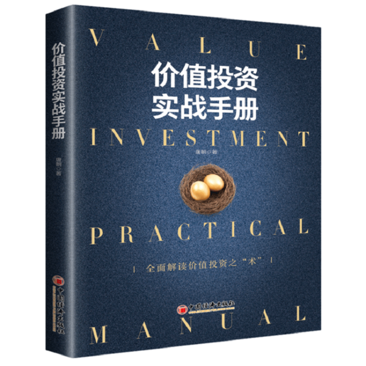

# 再读《价值投资实战手册》（唐朝）

***

在11月中下旬，花了两周时间又读了一遍唐朝的《价值投资实战手册》一书，简单记录新的体会和认识。

唐朝，书的作者，一名投资生活的人，怎么介绍他呢，看看豆瓣对作者的简要介绍：

<u>男，70后。</u>

<u>**1994年辞去事业单位公职，1995年进入期货市场。</u>*

<u>无数个不眠之夜，发奋苦读各类技术分析书籍，最终成功爆仓并破产于1996年。终得四字真言：“远离杠杆”。其后的奋斗，都投了房产和股票，收获还算满意。</u>

*<u>2006年底，关了公司，成为宅男，从此开始享受读书、运动和投资的悠闲生活，期间出版了畅销书《手把手教你读财报》《手把手教你读财报2：18节课看透银行业》。**</u>

豆瓣对本书的评价如下：[价值投资实战手册](https://book.douban.com/subject/30416923/)

2018年下半年，开始主动学习关于投资理财的相关知识，看了好多入门级的书，然后通过书找书，书读书，了解到这本书，就买回来看，记得那时2019年5月，买了看了，还记了好多笔记，像是一个小学生般的如饥似渴，希望在其中找到致富的法宝，窥探巴菲特股神的秘密。

此时此刻，已过半年，依然对这本书记忆深刻，所以想回头再读，因为老师说，要读书，读好书，我认为这是一本好书！

言归正传，谈谈再读此书的感受吧。

这本书作者很清晰的分了三部分：正确面对股价波动、如何估算内在价值、企业分析案例，内容简单明了，原理清晰，举例实际，可直接参照尝试，无论对初入股市或投资的新手还是投资界大咖老手，都有一种豁然开朗、温故知新的感受。

自己第一次读到此书，记录的笔记重点在于关于股票的相关概念、一些投资方法以及评估企业估值的方法等一些基本的、首次听到的概念，有一种如获珍宝、拿到密码的感觉，非常激动。

最近再读此书，理解又不同。对于之前了解的概念除了加深之外，更是随着时间的推移有了新的认识，一个普通人，如何投资，股票到底是什么，我们如何在其中获得收益，以及是不是还有其他的投资路径？也对巴菲特、格雷厄姆、费雪等投资大神更有了更如雷贯耳的了解。

这本书让你懂得：

1. 投资是件持续终身的事。因为，法币时代，现金是100%亏损的资产。另外，如笑来老师讲，投资是需要长期的，做一个长期主义者。
2. 股票是最好的资产，长期而言，股票的投资收益最高。是吗？听起来好像不是，因为，我们在股市好像从来没有赚到钱，而你却说，股票的投资收益最高，为什么？答案便在书中。
3. 股票是什么？股票的收益来源有：
   - 企业经营增值。股，与目标资产有关
   - 企业增发或下属公司IPO融资。股，与目标资产有关
   - 股票投资者情绪波动导致的股价无序波动。票，与目标资产或企业无关
4. 投资最简单的方法是：指数基金，一定要遵循循序渐进的方法：立足先赢，再求大赢。

以上几点，只是这本书的部分观点，对于如何正确面对股价波动、如何估算内在价值，我认为书前两章写的很清晰，一天时间就可读完，至于以及如何分析一个企业，作者在第三大章通过企业分析案例着重介绍，不过其中的数字很多，术语更多，建议选择自己熟的行业或公司进行阅读效果更好。感兴趣的朋友可以买了原著仔细品读，尝试践行，分享感悟。

------

这本书链接如下：

[京东](https://u.jd.com/HPVwsw)

[淘宝](https://m.tb.cn/h.eweQCSv?sm=4c4839)

[当当](http://product.dangdang.com/26445049.html)

