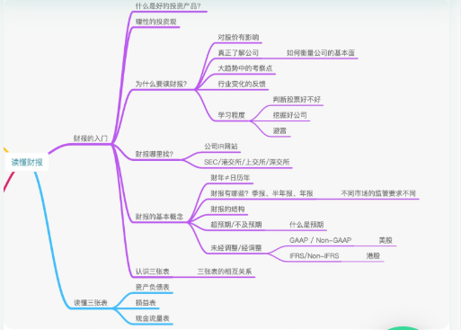
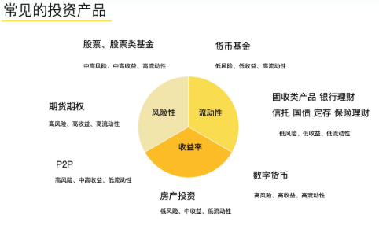
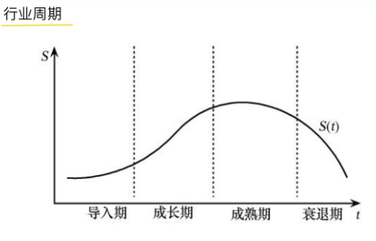
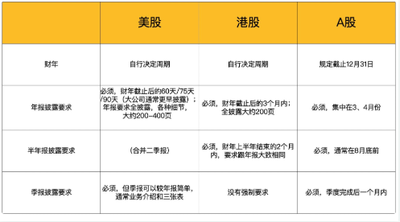
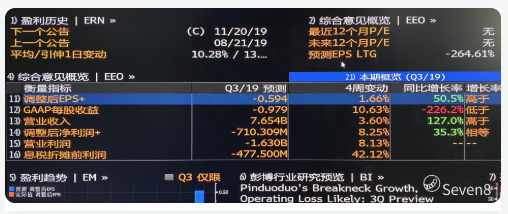
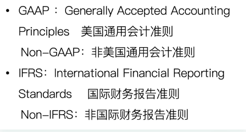
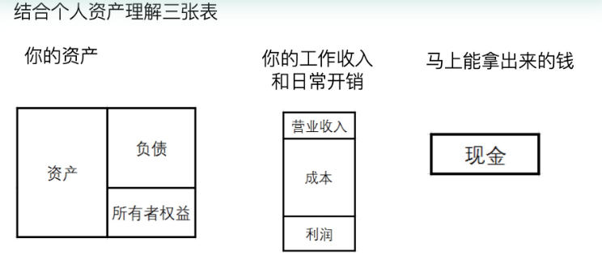
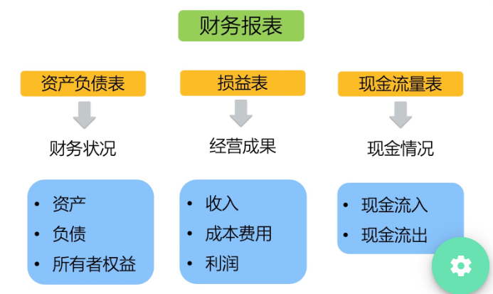

# 学习王珊老师《读懂财报》课 (1) 财报入门

王珊（授课）&copy; 邓亚军（整理） 2019-12-6

## 课程大纲

## 一、为什么要读财报，为什么要投资？

因为要抗通胀加保值，即还要实现资产的稳定增值！造成通胀的原因是央行的印钱，这是社会经济发展的必然趋势，谁都逃离不了。所以，抗通胀是我们老百姓投资的基本需求，而实现资产的稳定增长则是投资的高级诉求，那么，如何投资呢？**首先要建立正确的投资观念，那就是利用时间的优势，长期投资会带来的复利效应。**

那么投资产品有哪些呢？

好的投资标的又有什么特征呢？

> 产生现金流
>
> 内在经济价值
>
> 经理过长周期检验
>
> 可容纳大资金

房地产的背后经济价值是一个城市的发展、容纳能力、资金容纳力。

股票的背后价值是一个优质公司的成长红利，股票经过欧美市场长期的检验，流动性好，能容纳大资金，研究股票的价值就是研究股票未来的价值，股票波动、股票红利都会产生收益。

所以，选择股票投资是非常好的投资标的，是将自己的投资逻辑和认知的投资变现，因此，如何选择公司，什么才是好公司，什么才是好行业，以及社会发展经济背景等，这就需要我们对公司的基本面有了解，主要是：

> 公司所处的行业地位
>
> 商业模式
>
> 公司竞争力
>
> 公司盈利模式

那了解公司的基本面及公司的情况，最好的办法就是通过财报，以及同业公司的财报。

财报可以影响股价，通过读财报可以深度的、真正的了解一个公司，并且可以通过分析财报去排雷、避雷，让你不亏钱，先求不亏再求稳赚，另外，财报也是判断一个行业及公司发展大趋势的一个很好的观察和考察点，通过对比会更好的印证你的判断。

经济及行业都是有发展周期的。我们发现：经济周期是不断向上的，而行业周期是从有到无的。

**经济周期**：周而复始，下一个周期的高点比前一个周期的高点更高，低点也更高；股价的变动和经济周期的发展趋势一致，经济好的时候股价会上涨，经济衰退是股价会下跌，所以，财报就反应了一个经济状态，股市的一轮低点会高于上一轮的低点，高点也会高于上一轮的高点，他是顺应经济周期的，趋势永远也是随着经济周期上涨的。

**行业周期**：与经济周期则不同，行业周期不是周而复始，他是从有到无，因为一个行业的衰退往往是因为一项新的科学技术或技术方式取代了传统方式而导致，所以，观察行业的兴盛也是一个很好的指标，比如你选择处在衰退的行业周期中的一个企业，即使是该行业的龙头企业，那也没有意义，比如柯达公司。

## 二、财报从哪里找

公司网站：一般可以通过公司网站的投资者关系页面进行了解

交易所：可以证监会的官网的披露易进行了解

## 三、财报的基本概念

1、财年≠日历年

2、超预期和不及预期

Beat or Miss 通常指收入和净利润与市场预计的对比；

预期是什么？分析机构的一致预期（多家分析机构给出的平均预期），如下图：

3、经调整和未经调整

为什么有两种口径，因为企业会进行股权投资方面的资本运作行为，与公司实际的经营盈利还是有些差异，也有因为员工期权发放的考虑，在财务上因为不同规则下可以将该部分的投资不列入成本支出而会影响公司利润，所以，因为不同的会计准则就会涉及调整和未经调整。

所以，我们应该关注哪个指标呢？在关注公司净利润时我们会关注公司的整体盈利能力，所以，要看美国通用会计准则，选择未经调整；如果看公司经营项目时我们会关注公司发展趋势，我们就会倾向于剔除资本运作的行为，看非通用会计准则，选择经调整。

- [ ] 

4、财报结构

> 期内业务亮点
>
> 管理层讨论：体现公司的战略方向
>
> 详细财务及运营数据：体现公司每块业务的详细数据
>
> 三张表（财务报表）

## 四、认识三张表

> 资产负债表（Banlance Sheets）
>
> 损益表（Income Statements）
>
> 现金流量表（Statement of Cash Flows）

拿到一套财务报表时，应该先读财务表现摘要，这部分体现了公司整体的情况，然后读主席报告，这部分体现了公司战略亮点、展望和未来预期，最后找详细的业务，去看是哪些业务做得好、做得不好，找一些详细的内容和共识点。

结合个人来理解如下：

通过财务报表我们可以评估一个公司的哪些信息？

> 资产负债表（Banlance Sheets）：所有者权益=资产-负债，体现一个公司的财务状况，截止某一天的资产及财务状况；
>
> 损益表（Income Statements）：利润=收入-成本费用，体现公司在每一段时间内的经营成果、收入、盈余
>
> 现金流量表（Statement of Cash Flows）：体现公司一个月内现金的流入、流出状况；

------

<u>**后续内容继续学习中，下一节我们将带你全面了解三张表到底是什么东东？**</u>

> 1. 本文内容及图表来源于老虎证券的王珊老师在mixin上的BOX定投践行群授课内容整理而成，未经授课老师校核，文章内容可能与作者想法有偏差，请参考学习；
> 2. 本文只作为对财务或投资爱好者的学习和交流，不作为、也不允许作为任何商业用途使用；
> 3. 想了解和深入学习投资知识，请加微信：denzii，咨询了解，带你进践行群接触投资大佬，并对英语、编程、沟通、写作、财务、销售等知识进行系统学习，提升你的操作系统。
> 4. 喜欢读书的朋友可以关注或加入我的小组【读书与学习】（创作、激励、协作，区块链主导的创作者社区），分享你的读书感想，讨论新的读书计划，组队一起践行读书与学习，点击下面链接或者扫二维码进入：

[W3C社区小组：读书与学习](https://w3c.group/g/1124622/join?ref=2307e1c2)

