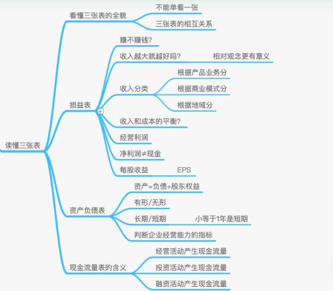
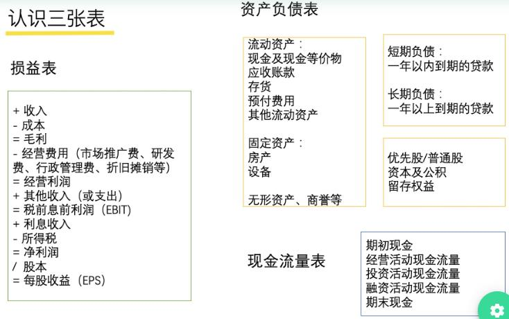
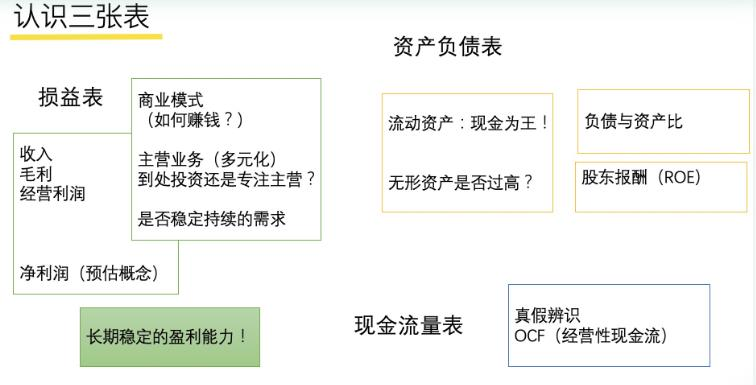
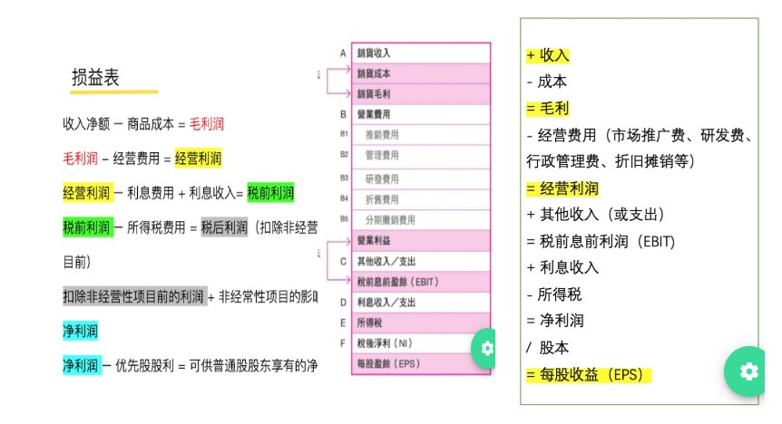
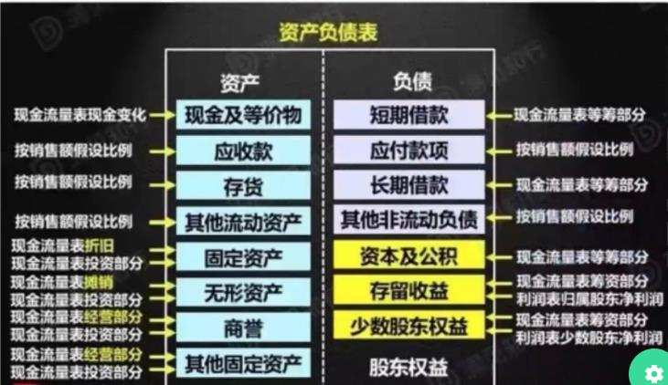
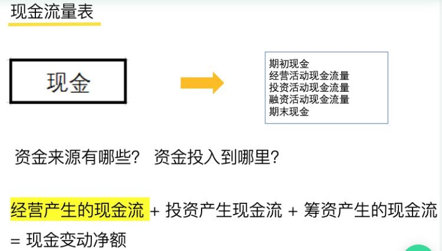

# 学习王珊老师《读懂财报》课 (2) 三张表

王珊（授课）&copy; 邓亚军（整理） 2019-12-16

## 课程大纲

## 一、认识三张表

财务报表是指在日常会计核算资料的基础上，按照规定的格式、内容和方法定期编制的，综合反映企业某一特定日期财务状况和某一特定时期经营成果、现金流量状况的书面文件。

> 损益表（Income Statements）：利润 = 收入 - 成本费用，体现公司在每一段时间内的经营成果、收入、盈余情况；
>
> 资产负债表（Banlance Sheets）：所有者权益 = 资产 - 负债，体现了一个公司的财务状况，注意是截止某一天的资产及财务状况；
>
> 现金流量表（Statement of Cash Flows）：体现公司一个时期内现金的流入、流出状况；

**三张表的关系**

三张表是相互作用、相互关联的关系，不能单独只看一张表，因为：

> 损益表（Income Statements）：损益表是我们看的最多的表，可以评估公司长期稳定的盈利能力，他反馈了一个公司的商业模式及盈利模式。可以看一个公司是靠什么赚钱？公司的主营业务是什么？是不是长期稳定的主营业务？是不是通过主营业务来创造长期的、稳定的盈利的？从而通过损益表来判断一个公司未来的盈利能力。
>
> 资产负债表（Banlance Sheets）：可以观察一个公司的流动资产（现金和现金等价物）情况，比如无形资产是否过高、商誉是否过高、资产负债率是否合理、ROE等信息；
>
> 现金流量表（Statement of Cash Flows）：可以观察和评估一个公司的账务是否在作假。

## 二、损益表

损益表，也叫利润表（P&L），反映企业某一段时间的销售收入和各项费用、净利润和每股收益等情况，通过损益表可以了解一个公司在某一段时间内是在赚钱还是在亏钱。

损益表中首先是收入，那么会问，收入越大是不是这个公司就越好呢？通过京东、阿里两个公司财报数据对比发现，其实不然，因为不同公司的不同业务模式在收入和成本方面的数据展现是不同的，所以要采取相对概念来评估才有意义。

所以，在损益表中看收入时就要看主要业务的收入，这反应一个公司商业模式以及长期稳定盈利的能力。要注意，不同公司的收入情况会按业务模式、产品、地域等类别进行收入的分类。

成本是什么？成本就是产品的硬材料投入。

费用是什么？费用是公司在经营过程中的相关投入，如销售、管理、财务方面的费用。

成本和费用哪个更重要呢？就是开源和节流的问题，二者都会影响经营利润，因此，**我们通过损益表来定义一个良好发展的企业标准是：收入增速稳定且可持续增长，成本增长但可控制，收入的增长速度超过了成本的增长速度，但带来净利润的稳定增长。**

每股收益（EPS）：将公司的收益分摊到所有股份，代表了股票的“含金量”。主要分为基本EPS和摊薄EPS，摊薄其实是稀释后的股本会比基本股本大，因为稀释要考虑：可转换优先股、期权、港股涡轮牛熊证等，从而造成股本股数的变化，所以，我们应该看稀释后的即摊薄EPS才是客观准确的。

最后，净利润不等于现金。净利润是一个公司盈利预估的概念，所以还得再看现金流量表。

## 三、资产负债表

资产负债表是反映某个时间点（特定的某一天）一个公司现有资产和负债的情况，是那一天的定格和拍照，资产 = 负债 + 所有者权益（净资产）：

> 资产：现金、应收账款、存货、房产、设备等；
>
> 负债：短期负债（1年内）和长期负债（一年以上）；
>
> 所有者权益（股东权益）：股东对企业的所有权，也称为净资产。

资产负债表一般按照流动性自上往下编排，把容易变现的放在最上面，可以看到现金和现金等价物在最前面。现金等价物是指高流动性的短期投资，可视为现金，一般任何可以在90天之内变现的金融资产都可以称为现金等价物，比如货币基金等。

商誉：买贵了的股份，收购价 - 净资产 = 商誉。即甲公司收购乙公司时，收购的价格高于乙公司的账面价值，高出的这一部分差就是商誉，就将差额记录在甲公司的商誉列中进行体现。如果我们看到一个公司资产负债表上的商誉连续增加，那么可以判断这家公司在不断地并购其他公司。

<u>*若一个公司的总资产周转率（收入/资产）比较低，但若其现金占总资产比率在25%以上时，此类公司也是比较厉害。*</u>

普通股、优先股

> 普通股：是公司的所有人，代表着对公司的所有权，有选举公司董事会的权利，同时能够得到相应的分红。
>
> 优先股：没有对公司经营的投票表决权，但是在普通股东分红之前就能获得固定或浮动的红利，当公司破产时还具有优先于普通股东的追诉权。

股东权益回报率：净利润 / 股东的所有者权益，越高说明公司用于留存收益的能力就越强，随着时间的积累，高额的股东权益会增加企业的内在价值，该部分公司可能会用作股票的回购；

债务股权比重：债务 / 股东的所有者权益，越低说明这家单位的运营能力越强；

资本公积：是公司溢价发行的股票获得更多的资金，比如公司20元的股票以30元发行，则差价10元就列入资本公积；

留存收益：是公司每年积累下来的净利润，其并没有反馈给股东，而是用作下一年的公司发展。

## 四、现金流量表

现金流量表，实际是在资产负债表和损益表基础上得到的，他反馈了公司实实在在的现金流入流出及收益情况，而损益表只是一个利润预估概念而非公司真实收入数据，所以，查看现金流量表可以弥补这方面的不足。

现金变动净额 = 经营活动现金流 + 投资活动现金流 + 筹资活动现金流

**经营活动现金流**：

> 直接反映了一个公司的真实盈利情况是不是大于零、大于利润、大于流动负债；
>
> 查看现金流量表需要和损益表对比着来看，看现金流量表的资金流入流出与损益表的净利润的变化趋势是否一致，是否大于零，这个很关键；
>
> 没有真实的现金流入，而仅仅是财报做账，那就需要注意了；

**投资活动现金流**：

> 投资一个公司或者项目方面；
>
> 投资资产，有形资产和无形资产；

**筹资活动现金流**：

> 包括银行的短期借款、股票回购、付利息、二级市场发放债券等活动的现金情况；

自由现金流：经营活动产生的现金流 - 公司资本、基本支出，资金活动现金流最能反映了一个公司经营的、真实的盈利情况。

------

<u>**后续内容继续学习中，下一节我们将学习如何使用不同的财务指标去评估一个公司的！**</u>

> 1. 本文内容及图表来源于老虎证券的王珊老师在mixin上的BOX定投践行群授课内容整理而成，未经授课老师校核，文章内容可能与作者想法有偏差，请参考学习；
> 2. 本文只作为对财务或投资爱好者的学习和交流，不作为、也不允许作为任何商业用途使用；
> 3. 想了解和深入学习投资知识，请加微信：denzii，咨询了解，带你进践行群接触投资大佬，并对英语、编程、沟通、写作、财务、销售等知识进行系统学习，提升你的操作系统。
> 4. 喜欢读书的朋友可以关注或加入我的小组【读书与学习】（创作、激励、协作，区块链主导的创作者社区），分享你的读书感想，讨论新的读书计划，组队一起践行读书与学习，点击下面链接或者扫二维码进入：

[W3C社区小组：读书与学习](https://w3c.group/g/1124622/join?ref=2307e1c2)

