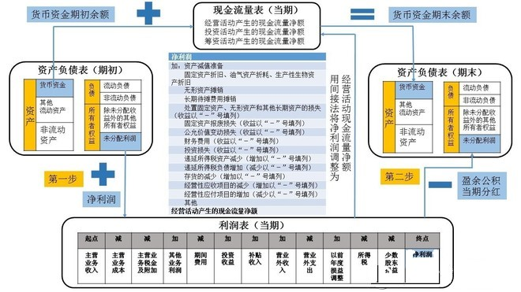

# 学习王珊老师《读懂财报》课 (3) 如何看表

王珊（授课）&copy; 邓亚军（整理） 2019-12-22

------

通常的财务实际是指上市公司在每个季度、半年、年度结束后根据公司这一段时间内的业绩表现所编制的财务报告，其包含在业绩期内的亮点、财务表现、经营数据以及三张财务报表。

那么拿到一个公司报表之后，我们应该怎么看呢？

## 一、如何看

一般先从公司的财务指标看起，比如：收入、利润、毛利率等，以及相关核心数据表现：

> 电商类公司：购物用户的数量等
>
> 互联网公司：日活、月活等方面指标

对不同类型的公司，我们关注的指标可能不同。我们也会看管理层讨论，主要是了解公司想告诉我们的关于公司战略方向、业务重点以及新的故事，而关于管理层讲的故事，要特别注意！

另外，可以在投资人业绩会的问答环节去了解一个公司的细节：分析师会问及公开的报告中所没有的数据或者问题，可以通过管理层的回答来了解公司的实际情况，在这过程中有可能会暴雷或发现惊喜。管理层的回答不及预期、表达谨慎、保守都会影响公司股价的直接变化。

## 二、看财报有什么技巧？

#### **1、看超预期指标**

看是以下两个指标是否超预期，是一个超还是两个都超，这两个指标会直接反映公司股价变化，要是没超预期，股价会下跌。若超预期就要深入再看其他核心数据。

> 收入预期：top line
>
> 每股净利润预期：bottom line 

#### **2、预期程度**

在看是否超预期前提下，再就要看超预期多少？大超预期、仅仅超预期还是符合预期。若是大超预期则非常好。另外要看发布预期的分析师是哪方面的？买卖双方的预期因为出发点不同而有差异，屁股决定脑袋，所以要注意这个实际情况。

#### **3、公司核心运营指标增长情况**

#### **4、下季度指引**

一般看收入指引，以及出货量等，这个指标很关键，这也会影响公司未来的预期。

#### **5、估值法**

常用市盈率PE指标对公司进行估值，PE = PRICE / EPS = bottom line（稀释后的）。

> 静态PE估值：按照过去一年经营数据计算的，等于：PE = PRICE / EPS；
>
> 动态PE估值：按照未来一年的数据进行估值，等于：PE = PRICE / 未来一年预计的EPS。

> 市销率PS估值：因为有些互联网公司还没有实现盈利，无法用PE进行估值，一般会用市销率PS进行估值，等于：PS = 当前股价 / 销售收入；
>
> 用PS估值会更加合理，不易出现被操作、负值或者无意义的情况，但是无法真实的反映公司当期的成本费用、毛利率正负情况等，所以有一定的局限性。但是，很多互联网公司都希望用PS指标来评估自己的公司。

#### **6、成熟的估值方法**

> **有市盈率的公司：看市盈率PE，还要看市销率PS，结合起来看；**
>
> **没有市盈率的公司：看市销率PS，还要看公司成本；**

#### **7、财务造假**

1987年股灾之后，SAC（Securities Association of China，中国证券业协会）规定上市公司要提交现金流量表， 因为利润表造假空间太大。有以下几种常见造假方式：

> **应收账款**：如果一个公司应收账款占总资产比例突然增大，特别是要注意虚拟商品打赏或电商平台类业务模式的公司，应收账款到账时间越来越长，现金占总资产的比例没有同比例的上升，那么我们就需要怀疑该公司可能在刷流水做假账。

> **商誉减值**：是资产负债表的一个雷区，有些上市公司通过不断并购其他公司，然后将业务流水合并计入上市公司的销售收入，以增加公司PS估值，其中并购溢价部分会反映在上市公司财报——资产负债表中的商誉一栏，但是被收购的公司可能在某一天会暴雷，所以，要特别关注商誉占比大的公司。

> **固定资产折旧**：通过改变固定资产折旧年限，以降低公司每年折旧费用，降低当年的费用，从而提高公司净利润，因此，要看在折旧方面的造假情况就需要关注现金流量表的反映情况。

> **预付费商业模式**：如教育、健身行业的商业模式，要注意：公司一般应收账款会突然增多，前期现金流非常高，后期可能会枯竭，所以要注意此类公司的应收和现金流的比例是否合理。

通常情况，现金流一定要大于公司净利润。因为净利润里面含有很多折旧摊销等费用，但是现金里面没有，所以现金流入要大于净利润，并且大于公司的流动负债即短期负债，也就是说 ，今天到的钱必须要能还得起短期的负债，这是理所当然的，也是一个公司比较健康的状态。

## 三、总结

如何看一个公司财报：

1. **收入和净利润指标是否超预期。若这两个核心指标都未超预期，那要特别注意，因为这会直接反映到公司股价上；**
2. **超预期指标分析后，还要分析运营数据，如日活、月活、购物用户数等，去分析公司为什么未超预期，从而判断是否值得抄底；**
3. **公司下季度的指引，这表达了公司下季度的信心和指数，还要看管理层讨论，但是不能听他们讲故事，还要看分析师的提问，关注是否有特别注意的问题、核心指标等。**

------

<u>**后续内容继续学习中，下一节我们将通过电商公司的财报数据进行实例解读，欢迎继续关注！**</u>

> 1. 本文内容及图表来源于老虎证券的王珊老师在mixin上的BOX定投践行群授课内容整理而成，未经授课老师校核，文章内容可能与作者想法有偏差，请参考学习；
> 2. 本文只作为对财务或投资爱好者的学习和交流，不作为、也不允许作为任何商业用途使用；
> 3. 想了解和深入学习投资知识，请加微信：denzii，咨询了解，带你进践行群接触投资大佬，并对英语、编程、沟通、写作、财务、销售等知识进行系统学习，提升你的操作系统。
> 4. 喜欢读书的朋友可以关注或加入我的小组【读书与学习】（创作、激励、协作，区块链主导的创作者社区），分享你的读书感想，讨论新的读书计划，组队一起践行读书与学习，点击下面链接或者扫二维码进入：

[W3C社区小组：读书与学习](https://w3c.group/g/1124622/join?ref=2307e1c2)

